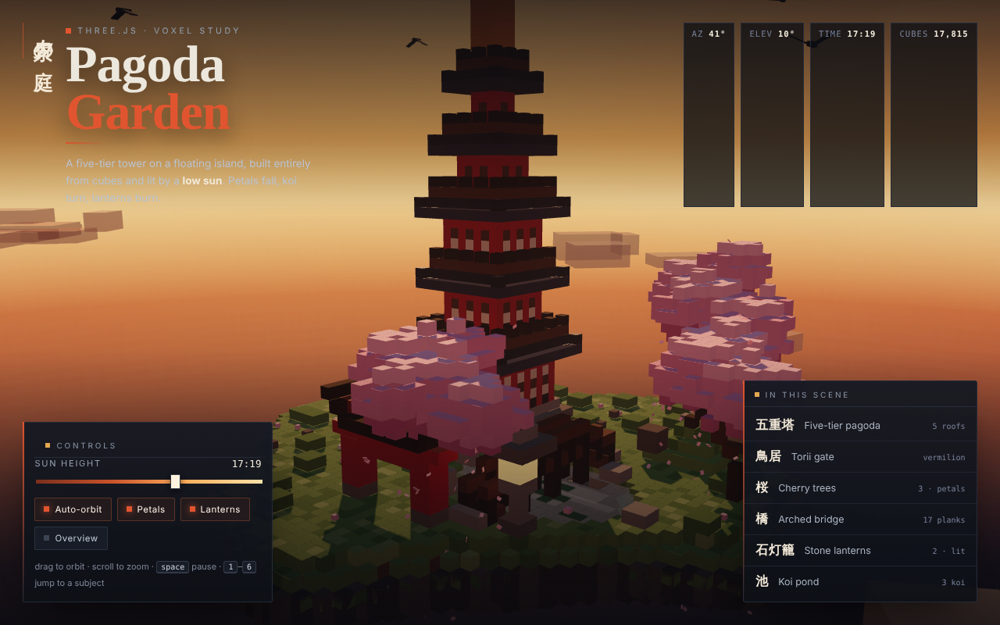

# AI one-shots

Small, self-contained projects written by AI coding assistants, mostly from a
single prompt, with at most a few follow-up corrections. Each one lives in its
own folder; this file records the prompt each started from, the model that
wrote it, and what it cost where that's known.

## Running them

Most are static web pages. Some browsers won't load ES modules from `file://`,
so serve the folder you want to view, for example:

```sh
npx serve ai-oneshots/pagoda-garden
```

## Projects

### [`pagoda-garden/`](pagoda-garden/)

Voxel Japanese garden in Three.js: a 5-tier pagoda, torii, cherry trees, a pond
with a wooden bridge and stone lanterns, on a grass island lit by a sunset.

**Prompt:**

> Make a small voxel Pagoda Garden scene in Three.js. One file index.html,
> Three.js + OrbitControls from CDN via import map. Everything from cubes on a
> grass island: 5-tier pagoda (dark roofs, red columns), red torii, 2–3 cherry
> trees, pond with wooden bridge, a couple of stone lanterns. Warm sunset light
> with shadows, slowly auto-rotating orbit camera. Only standard Three.js
> materials, no custom shaders. Keep it simple and make it work.

| | Claude Code ([`index.html`](pagoda-garden/index.html)) | Strata ([`Strata/`](pagoda-garden/Strata/)) |
| --- | --- | --- |
| Model | Claude Opus 5.5, medium effort | qwen3.8-flash-next-iq3_xxs (local) |
| Runs on | Claude Code 2.1.291, cloud session on claude.ai | Strata engine v0.1.40, TITAN V + GTX 1080 Ti |
| Follow-ups | 1, a layout fix: the bridge crossed the pond the long way and didn't meet the path | 3, bug fixes: stuck on the loading screen in Firefox, then two runtime errors |
| Wall time | ~11 min, ~4 to the first version | ~71 min, ~60 of it generating |
| Output tokens | 22,030 | 106,157 |
| Input tokens | 566 uncached, 64,698 cache writes, 2,555,004 cache reads | 92,410 prompt, 54,795 of them reused |
| Cost | ~$1.47 (API-equivalent, as reported by the session) | none (local hardware) |
| Size | 293 lines, ~11 KB | 1,000 lines, ~49 KB, with an on-screen control panel and HUD |

<table>
<tr>
<td></td>
<td></td>
</tr>
<tr><td align="center">Claude Code</td><td align="center">Strata</td></tr>
</table>

Claude Code's token and cost figures are cumulative for the whole session, so
they also include moving the project into this folder and writing these
READMEs, which were a small share of the total. Most of the cache-read volume
comes from re-sending the conversation on each tool call, including the
screenshots taken to check the render. See [`Strata/README.md`](pagoda-garden/Strata/README.md)
for the Strata follow-up prompts and per-turn stats.
