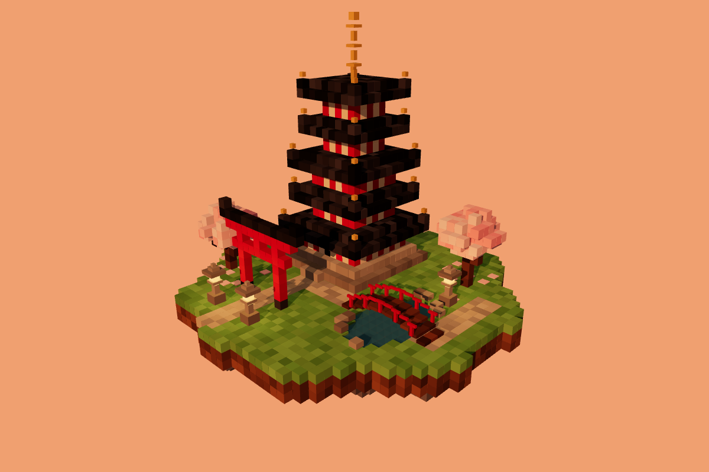

# AI one-shots

Small, self-contained projects written by AI coding assistants, mostly from a
single prompt, with at most a few follow-up corrections.

## Layout

Each project gets a folder named after what it is, and each attempt at it
gets its own subfolder named after the tool that produced it, plus the
setting that differs when the same tool was run more than once
(`Strata-thinking-high/`, `Strata-thinking-low/`):

```
<project>/
  <tool>/
    README.md       model, hardware, follow-up prompts, run stats
    index.html      the attempt itself
    screenshot.png
```

This file records the shared prompt for each project and compares the attempts.

## Running them

Most are static web pages. Some browsers won't load ES modules from `file://`,
so serve the folder you want to view, for example:

```sh
npx serve ai-oneshots/pagoda-garden/Claude-Code
```

## Projects

### [`pagoda-garden/`](pagoda-garden/)

Voxel Japanese garden in Three.js: a 5-tier pagoda, torii, cherry trees, a pond
with a wooden bridge and stone lanterns, on a grass island lit by a sunset.

**Prompt:**

> Make a small voxel Pagoda Garden scene in Three.js. One file index.html,
> Three.js + OrbitControls from CDN via import map. Everything from cubes on a
> grass island: 5-tier pagoda (dark roofs, red columns), red torii, 2–3 cherry
> trees, pond with wooden bridge, a couple of stone lanterns. Warm sunset light
> with shadows, slowly auto-rotating orbit camera. Only standard Three.js
> materials, no custom shaders. Keep it simple and make it work.

| | [Claude Code](pagoda-garden/Claude-Code/) | [Strata, thinking high](pagoda-garden/Strata-thinking-high/) | [Strata, thinking low](pagoda-garden/Strata-thinking-low/) |
| --- | --- | --- | --- |
| Model | Claude Opus 5.5, medium effort | qwen3.8-flash-next-iq3_xxs (local), thinking high | same, thinking low |
| Runs on | Claude Code 2.1.291, cloud session on claude.ai | Strata engine v0.1.40, TITAN V + GTX 1080 Ti | Strata, different machine (TBD) |
| Follow-ups | 1, a layout fix: the bridge crossed the pond the long way and didn't meet the path | 3, bug fixes: stuck on the loading screen in Firefox, then two runtime errors | 1, a layout fix: the bridge wasn't over any water |
| Wall time | ~11 min, ~4 to the first version | ~71 min, ~60 of it generating | ~7 min, ~3.4 of it generating |
| Output tokens | 22,030 | 106,157 | 9,625 |
| Input tokens | 566 uncached, 64,698 cache writes, 2,555,004 cache reads | 92,410 prompt, 54,795 of them reused | 4,073 prompt, 246 of them reused |
| Cost | ~$1.47 (API-equivalent, as reported by the session) | none (local hardware) | none (local hardware) |
| Size | 293 lines, ~11 KB | 1,000 lines, ~49 KB, with an on-screen control panel and HUD | TBD |

<table>
<tr>
<td></td>
<td></td>
</tr>
<tr><td align="center">Claude Code</td><td align="center">Strata, thinking high</td></tr>
</table>

See each attempt's README for its follow-up prompts and full run stats.
Claude Code's figures cover the whole session, including the repo housekeeping.
