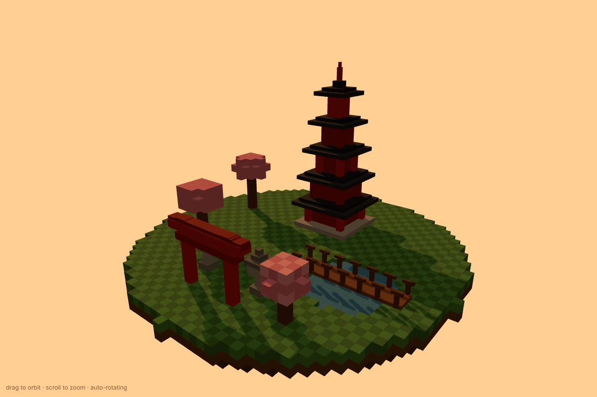

# Pagoda garden: Strata, thinking low

The same pagoda garden prompt and the same model as
[`../Strata-thinking-high/`](../Strata-thinking-high/), but with thinking set
to low and on a different machine. The result is much simpler, but it worked
on the first try apart from one visual bug, and it was over ten times faster.

## Model and engine

| | |
| --- | --- |
| Model | qwen3.8-flash-next-iq3_xxs |
| Thinking | low |
| Engine | TBD |

## This PC

| | |
| --- | --- |
| Machine | Unraid server ("Wendy") |
| GPU | NVIDIA GeForce RTX 5060 Ti, 16 GB, PCIe Gen3 x8 |
| CPU | Intel Core i7-9700K @ 3.60 GHz |
| RAM | 64 GiB DDR4 |

## Follow-up prompts

1. *"There's a bridge, but it isn't going over any water at all, much less a
   pond"*

## Run stats

| Started | Turn | Prompt | Reused | Output | Tok/s | VRAM hit rate | Duration |
| --- | --- | ---: | ---: | ---: | ---: | --- | ---: |
| 03:35:08 PM | Original prompt | 251 | 0 | 4,732 | 50.2 | 80.6% +2.1% PCIe | 98.4 s |
| 03:40:40 PM | Follow-up 1 | 3,822 | 246 | 4,893 | 48.3 | 75.8% +3.2% PCIe | 107.5 s |
| | **Total** | **4,073** | **246** | **9,625** | | | **205.9 s** |

That's about 3.4 minutes of generation and about 7 minutes of wall-clock time
from the first prompt to the last answer, including testing between turns.
Compared with thinking high, it produced about a tenth of the output tokens
in about a seventeenth of the generation time. No API cost, since it ran
locally.
