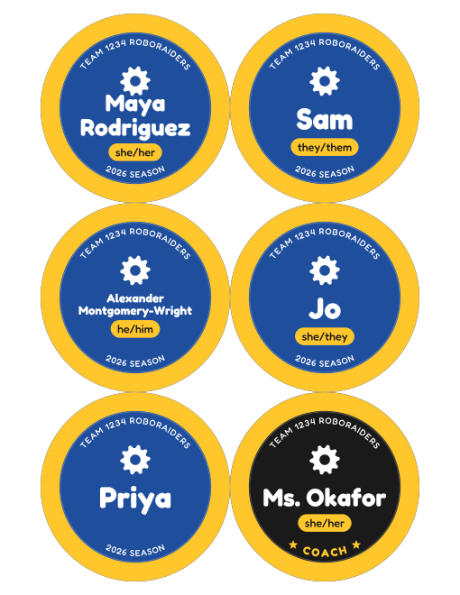

# Robotics team buttons

Makes name buttons for the team from a spreadsheet: one SVG per person, plus a
print-ready PDF with them laid out on letter (or A4) paper.



## Setup

Python 3.9+:

```sh
pip install -r requirements.txt
```

(`cairosvg` needs the Cairo library. It's already there on most Linux
desktops; on macOS `brew install cairo`; on Windows the easiest route is to
install GTK, or run this under WSL.)

## Use

1. Make a CSV like [`example.csv`](example.csv). Columns:
   - `name`: what goes on the button. Long names shrink, then wrap to two lines.
   - `pronouns`: shown in a pill under the name. Leave blank to skip it.
   - `role`: blank or `student` for kids. Anything else (`coach`, `mentor`,
     `parent volunteer`...) gets the coach design, with that word arced along
     the bottom between two stars.
   - `copies` (optional): how many of that button to print.
2. Run it:

   ```sh
   python make_buttons.py people.csv --logo logo.png \
       --team "Team 1234 RoboRaiders" --tagline "2026 Season"
   ```

3. Print `out/buttons.pdf` at **100% / "Actual size"**, not "Fit to page", or
   the circles won't be 3.5 in. Print one page first and check it against
   your cutter.

Output goes to `out/`:

- `svg/<name>.svg`: each button on its own, 3.5 in square. Text is converted
  to outlines and the logo is embedded, so they open anywhere (Inkscape,
  Illustrator, a browser) with no fonts or extra files.
- `page-N.svg`: the print layout, if you want to tweak a page by hand.
- `buttons.pdf`: everything, ready to print.

## The design

- **Students**: team colour background, logo, big name, pronoun pill,
  team name arced across the top and an optional tagline across the bottom.
- **Coaches/mentors**: dark background with the role (`COACH`, `MENTOR`)
  arced across the bottom in the accent colour, so they're easy to spot.
- If you don't pass `--logo`, a gear is drawn as a stand-in. A PNG with a
  transparent background looks best.

## Sizes

The defaults are for a 3 in button press with a 3.5 in cut circle:

| Option | Default | What it is |
| --- | --- | --- |
| `--cut` | 3.5 | Diameter of the paper circle you cut out. The background colour bleeds all the way to here. |
| `--face` | 3.0 | Diameter of the flat front of the finished button. Everything outside this wraps around the edge. |
| `--safe` | 2.7 | Logo and text stay inside this circle so nothing important ends up on the curve. |

The accent-colour ring starts just inside the face edge, so a slightly
off-centre press still looks intentional. Add `--guides` to draw the face
(pink) and safe area (blue) as dashed circles while you check the fit with a
test print; leave it off for the real run.

If your press is a different size, measure the cut circle and the finished
button and pass those; the layout scales to match.

## Other options

```
--color / --accent              student background and ring/pill colours (hex)
--coach-color / --coach-accent  same for coaches
--blanks N                      add N spares with no name (for new members or mistakes)
--paper letter|a4               page size (6 buttons per page either way at 3.5 in)
--margin / --gap                page margin and space between circles, inches
--out DIR                       output folder
```

The font is [Fredoka](https://fonts.google.com/specimen/Fredoka) (SIL Open
Font License, see [`fonts/OFL.txt`](fonts/OFL.txt)).
